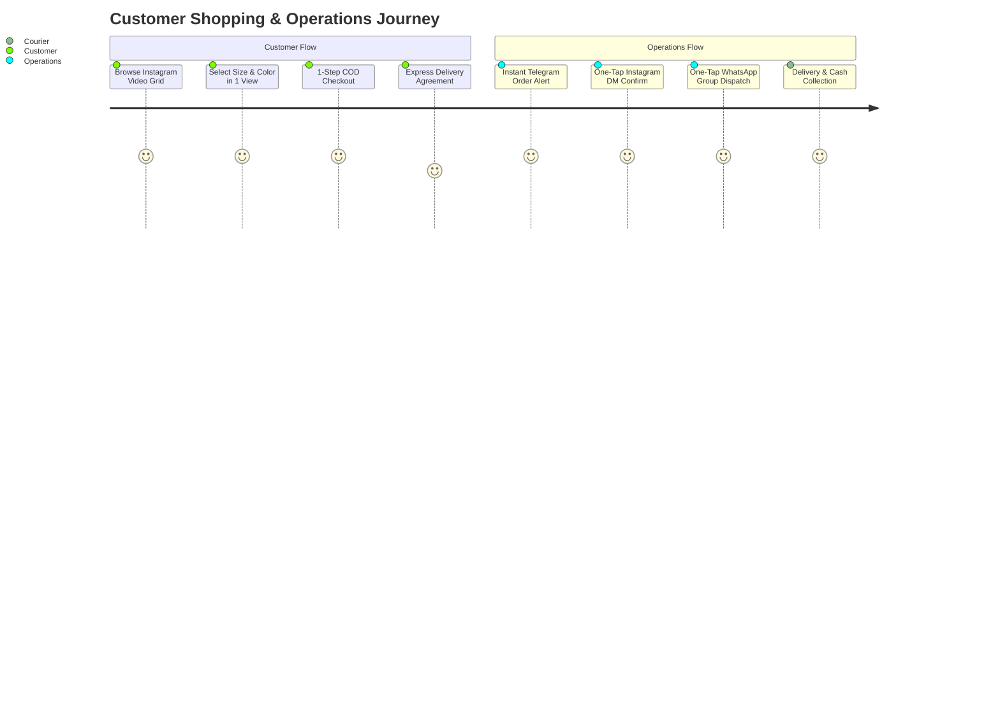
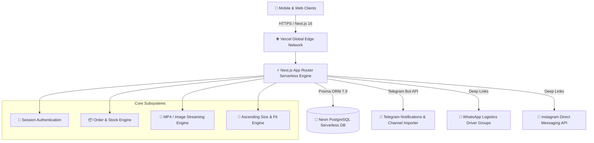
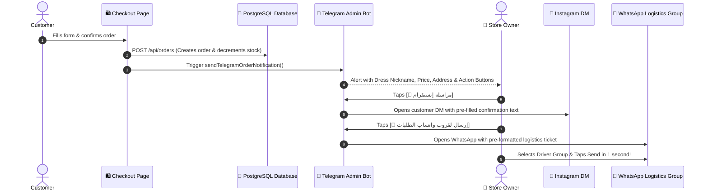

# Product Requirements Document (PRD)
## Riva Boutique — Luxury E-Commerce & Conversational Commerce Platform

---

| **Document Version** | **Status** | **Author** | **Last Updated** |
| :--- | :--- | :--- | :--- |
| `v1.2.0` | **Production Ready** | DeepMind Agentic Engineering & Riva Architecture Team | August 2026 |

---

## 1. Executive Summary & Product Vision

### 1.1 Product Overview
**Riva Boutique** (`riva.dress1`) is a high-end luxury fashion e-commerce platform engineered specifically for evening and modest dresses in Jordan and the MENA region. 

Unlike traditional static web stores, Riva bridges the gap between **Instagram video shopping (Reels-style experience)** and **automated conversational commerce (Telegram Bot + WhatsApp Logistics + Instagram Direct Messaging)**. Customers experience zero-friction shopping with Cash on Delivery (COD) and optional home try-on, while the operations team manages inventory, syncs products from Telegram channels with 1 click, and dispatches delivery tickets instantly to WhatsApp driver groups.

### 1.2 Core Business Objectives
1. **Maximize Mobile Conversion Rate:** Provide an immersive, sub-second, mobile-first video catalog that replicates the social media browsing experience.
2. **Eliminate Operational Friction:** Automate order intake, inventory decrement, customer confirmation, and delivery dispatch without manual data re-entry.
3. **Protect Logistics Margins:** Distinct workflows for standard delivery (with inspection) vs. Express VIP delivery (no inspection agreement protection).
4. **Instant Channel Syncing:** Allow real-time ingestion of new fashion releases directly from Telegram channel posts into the live database.

---

## 2. User Personas & Target Audience



### Persona A: The Luxury Fashion Buyer (Customer)
* **Demographics:** Females aged 18–45 in Jordan (Amman, Irbid, Zarqa, and all governorates).
* **Browsing Habits:** 95%+ mobile traffic (Instagram, TikTok). Prefers video demonstrations over static photos to inspect fabric quality and movement.
* **Pain Points:** Hesitant to pay online; requires Cash on Delivery (COD) and fast delivery with clear size guidance.

### Persona B: Boutique Operations & Fulfillment Manager (Admin)
* **Responsibilities:** Managing incoming orders, verifying customer addresses via Instagram DMs, updating stock, and assigning shipments to delivery drivers.
* **Pain Points:** Wasting time copying and pasting customer details between Instagram, spreadsheets, and WhatsApp courier groups.

---

## 3. System Architecture & Tech Stack

### 3.1 Technical Architecture Diagram



### 3.2 Technology Stack
* **Framework:** Next.js 16.3 (Turbopack, App Router, React 19, Server Components & Serverless Routes).
* **Database & ORM:** PostgreSQL on Neon Serverless with Prisma ORM `v7.9`.
* **Design System:** Custom Luxury CSS Design System (Color Palette: Royal Burgundy `#722F37`, Champagne Gold `#D4AF37`, Cream `#FAF7F2`, Dark Charcoal `#1C0A10`) styled with Cairo typography.
* **Hosting & CDN:** Vercel Serverless Edge Platform with strict Cache-Control bypass headers.
* **External APIs:**
  * Telegram Bot API (`v7.x`) for instant admin notifications and channel scraping.
  * WhatsApp URI API (`wa.me` / `api.whatsapp.com`) for direct dispatch.
  * Instagram Direct URI (`ig.me/m/`) for 1-click verification.

---

## 4. Core Functional Modules & Specifications

---

### 4.1 Mobile-First Product Catalog & Video Gallery
* **Instagram 3:4 / 4:5 Aspect Ratio:** Product cards present vertical videos and portrait photography tailored for smartphones.
* **Single-Viewport Layout (Above-the-Fold Optimization):**
  1. **Dress Title & Price Header:** Located at the top above the video player.
  2. **High-Definition Video Frame:** Autoplay, muted, loop, inline MP4 video stream.
  3. **Color Picker Swatches:** Directly underneath the video. Tapping a color dynamically swaps the active video/photo without displacing the viewport or requiring vertical scroll.
  4. **Ascending Numerical Size Selector:** Strict numerical ordering (`36 → 38 → 40 → 42 → 44 → 46 → 48`).
  5. **Smart Fit & Size Calculator Modal:** Provides instant size recommendations based on customer height, weight, and bust measurements.
  6. **One-Tap Direct Order CTA:** Primary high-contrast button (`🛒 اطلبي الآن — الدفع عند الاستلام`).

---

### 4.2 Intelligent Checkout & Express VIP Delivery Protection
* **Simplified 1-Step Form:** Full Name, Phone (`07XXXXXXXX` Jordan validation), Governorate (Amman, Irbid, Zarqa, etc.), Detailed Address, and Instagram Username.
* **Delivery Method Matrix:**
  * **Standard Delivery (3 JOD):** Includes home inspection and trying on prior to payment. Delivery estimated at 24–48 hours.
  * **Express VIP Delivery (3 JOD Amman / 5 JOD Governorates):** Direct private courier delivery within hours.
* **Mandatory Express Delivery Protection Modal:**
  * If the user selects Express Delivery, submitting the form triggers a mandatory confirmation modal:
    * *Notice:* "Express Delivery is a direct VIP expedited dispatch and **does NOT include inspection or trying on upon arrival**."
    * *Action:* Customer must check `☑️ I agree that Express Delivery does not include home try-on or inspection` to unlock the submit button.
    * *Alternative:* Customer can tap `🔄 Switch to Standard Delivery (with try-on)`.

---

### 4.3 Automated Omnichannel Fulfillment & Logistics Flow



#### A. Telegram Order Notification Card
Contains the order code (`RIVA-XXXX`), customer name, phone, address, delivery type badge, item list using **Dress Nicknames** (e.g. `فستان الأميرة الملكي 👑`), total price, and ready-to-copy minimal Arabic confirmation message.

#### B. WhatsApp Driver Group Logistics Template
When tapping `[📲 إرسال لقروب واتساب الطلبات]`, WhatsApp opens instantly with this dynamic structure pre-filled:
```text
الاسم: [Customer Name]
رقم الهاتف: [Phone Number]
الموقع: [City / Detailed Address]
السعر : [Total] دينار شامل التوصيل [ (فوري) if Express ]
[Dress Nickname] [Color] سايز [Size]
```

---

### 4.4 1-Click Telegram Channel Importer (AI & Direct Parsing)
* Connects directly to the boutique's official Telegram channel (`@riva_boutique_dresses`).
* Parses new posts: extracts dress title, price in JOD, available colors, sizes, and media files (images & MP4 videos).
* Saves items directly into PostgreSQL with automated variant mapping and ascending size normalization.

---

### 4.5 Administrative Control Panel (`/admin`)
* **Dashboard:** Real-time revenue metrics, daily order volume, active stock count, and pending notifications.
* **Order Management (`/admin/orders`):** Status lifecycle filter (`pending`, `confirmed`, `shipped`, `delivered`, `cancelled`), customer contact links, and fulfillment notes.
* **Product & Inventory Management (`/admin/products`):**
  * Visual color & size variant matrix with real-time stock counters.
  * Direct URL media uploader supporting video URLs (`.mp4`) and photo links.
  * Dress Nickname (لقب الفستان) assignment for streamlined operations.

---

## 5. Database Schema (Prisma / PostgreSQL)

```prisma
model Dress {
  id          Int            @id @default(autoincrement())
  name        String
  nickname    String?        // Operational nickname (e.g. "الملكي", "فروتي")
  description String?
  price       Float
  isNew       Boolean        @default(false)
  isFeatured  Boolean        @default(false)
  createdAt   DateTime       @default(now())
  updatedAt   DateTime       @updatedAt
  variants    DressVariant[]
  orderItems  OrderItem[]
}

model DressVariant {
  id         Int          @id @default(autoincrement())
  dressId    Int
  dress      Dress        @relation(fields: [dressId], references: [id], onDelete: Cascade)
  color      String
  colorHex   String
  size       String       // "36", "38", "40", "42", "44", "46", "48"
  quantity   Int          @default(0)
  images     DressImage[]
  orderItems OrderItem[]
}

model DressImage {
  id        Int          @id @default(autoincrement())
  url       String       // MP4 video link or Image URL
  variantId Int
  variant   DressVariant @relation(fields: [variantId], references: [id], onDelete: Cascade)
}

model Order {
  id           Int         @id @default(autoincrement())
  customerName String
  phone        String
  city         String
  address      String
  instagram    String?
  notes        String?
  status       String      @default("pending") // pending | confirmed | shipped | delivered | cancelled
  total        Float
  createdAt    DateTime    @default(now())
  updatedAt    DateTime    @updatedAt
  items        OrderItem[]
}

model OrderItem {
  id        Int          @id @default(autoincrement())
  orderId   Int
  order     Order        @relation(fields: [orderId], references: [id], onDelete: Cascade)
  dressId   Int
  dress     Dress        @relation(fields: [dressId], references: [id])
  variantId Int
  variant   DressVariant @relation(fields: [variantId], references: [id])
  quantity  Int          @default(1)
  price     Float
}
```

---

## 6. Non-Functional & Security Requirements

| Category | Specification | Implementation Strategy |
| :--- | :--- | :--- |
| **Performance** | Page Load < 800ms, TTFB < 200ms | Next.js Server Components, Turbopack, CDN caching with aggressive asset optimization. |
| **Mobile UX** | 100% Responsive, Zero Shift (CLS = 0) | Fixed aspect ratios (`3:4`), in-viewport video switching, bottom navigation bar. |
| **Security** | OWASP Top 10 Compliance | Strict HTTP Headers (`X-Frame-Options: DENY`, `X-Content-Type-Options: nosniff`, `Strict-Transport-Security`). |
| **Authentication** | Admin session cookie security | Base64 salted SHA cryptographic session validation for `/admin` and `/api/admin/*`. |
| **Data Integrity** | Concurrency-safe inventory | Atomic Prisma transactions decrement variant stock upon successful order creation. |

---

## 7. Future Strategic Roadmap

### Phase 2: GCC Expansion & Online Payments (Q4 2026)
* Multi-currency switcher (SAR, AED, KWD, USD, JOD).
* Integration with Tap Payments / HyperPay for Apple Pay, Visa, and Mastercard transactions.
* Automated SMS notification triggers via Twilio / Unifonic.

### Phase 3: AI Fashion Stylist & Automated WhatsApp Bot (Q1 2027)
* Virtual AI assistant for personalized dress recommendations based on body shape and event type.
* Direct WhatsApp Webhook Bot capable of confirming orders and dispatching live tracking links automatically.

---

*Document approved by Riva Boutique Engineering.*
